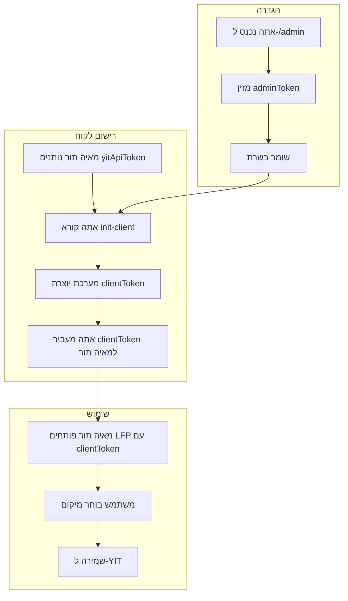
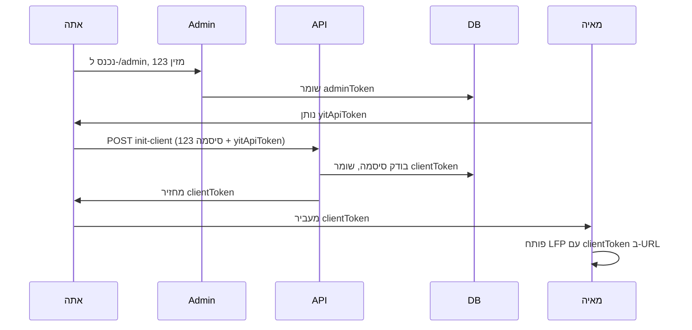

# פלואו המערכת – הסבר ויזואלי מלא

## מה יש במערכת? (השחקנים)

```
┌─────────────────────────────────────────────────────────────────────────────┐
│                                                                             │
│   ┌───────┐      ┌─────────────┐      ┌─────────────┐      ┌─────────────┐  │
│   │  YIT  │      │  מאיה תור   │      │     אתה     │      │   משתמש     │  │
│   │       │      │  (לקוח)     │      │  (בעל LFP)  │      │  (אדם)      │  │
│   └───────┘      └─────────────┘      └─────────────┘      └─────────────┘  │
│   שירות           חברה שרוצה           אתה – מנהל          אדם שצריך      │
│   מיקומים         להשתמש ב-LFP         המערכת              לבחור כתובת   │
│                                                                             │
└─────────────────────────────────────────────────────────────────────────────┘
```

---

## שלב 0: מה יש לפני שמתחילים?

```
                    ┌─────────────────────────────────────┐
                    │           המערכת LFP                 │
                    │  (דף מפה לבחירת כתובת)               │
                    │                                     │
                    │  יש לך: שרת, דף /admin, API          │
                    │  אין עדיין: לקוחות רשומים            │
                    └─────────────────────────────────────┘
```

---

## שלב 1: הגדרת סיסמת אדמין (פעם אחת)

**מה עושים:** בוחרים סיסמה שתגן על ה-API.

```
    ┌─────────┐
    │   אתה   │
    └────┬────┘
         │
         │  1. נכנס ל-/admin
         │  2. מזין סיסמה (למשל: 123)
         │  3. לוחץ "שמור טוקן אדמין"
         │
         ▼
    ┌─────────────────┐
    │  דף /admin      │
    │  [____123____]  │
    │  [  שמור  ]     │
    └────────┬────────┘
             │
             │  הסיסמה נשמרת
             ▼
    ┌─────────────────┐
    │  מסד הנתונים    │
    │  adminToken:    │
    │  "123"          │
    └─────────────────┘
```

**תוצאה:** מעכשיו רק עם הסיסמה "123" אפשר להוסיף לקוחות.

---

## שלב 2: מאיה תור רוצים להתקין LFP

**מה עושים:** מאיה תור נותנים לך טוקן, אתה יוצר להם clientToken.

### 2א. מאיה תור נותנים לך yitApiToken

```
    ┌─────────┐                    ┌─────────────┐
    │   YIT   │                    │  מאיה תור   │
    │         │  yitApiToken       │             │
    │  (יש    │ ────────────────► │  (יש להם)   │
    │  להם)   │  "abc-xyz-789"     │             │
    └─────────┘                    └──────┬──────┘
                                          │
                                          │  נותנים לך
                                          │  "הנה הטוקן שלנו"
                                          ▼
                                   ┌─────────────┐
                                   │     אתה     │
                                   │  (מקבל)     │
                                   └─────────────┘
```

### 2ב. אתה מזין את ה-yitApiToken – **איפה?**

**בדף /admin** – יש סעיף "הוסף לקוח חדש":

```
    ┌─────────────────────────────────────────────────────────┐
    │  הוסף לקוח חדש                                          │
    │                                                         │
    │  yitApiToken (שקיבלת ממאיה תור):                        │
    │  [____abc-xyz-789____]  ← כאן אתה שם את הטוקן!           │
    │                                                         │
    │  [  הוסף לקוח  ]                                        │
    └─────────────────────────────────────────────────────────┘
```

**חשוב:** קודם צריך להזין טוקן אדמין (בסעיף למעלה) ולשמור, או להזין טוקן אדמין ב"הצג לקוחות".

### 2ג. מה קורה כשלוחצים "הוסף לקוח"

```
    ┌─────────┐
    │   אתה   │  לוחץ "הוסף לקוח"
    └────┬────┘
         │
         │  שולח בקשה:
         │  POST /api/admin/init-client
         │  סיסמה: 123 (adminToken)
         │  גוף: yitApiToken = "abc-xyz-789"
         │
         ▼
    ┌─────────────────────────────────────┐
    │           API init-client            │
    │                                     │
    │  בודק: סיסמה 123 נכונה? ✓            │
    │  יוצר: clientToken חדש (UUID)        │
    │  שומר: clientToken ↔ yitApiToken    │
    └─────────────────┬───────────────────┘
                      │
                      │  מחזיר:
                      │  { "clientToken": "b380dc34-6754-4b50-8a35-cd714f201d6a" }
                      ▼
    ┌─────────┐
    │   אתה   │  ◄──  מקבל את ה-clientToken
    └────┬────┘
         │
         │  מעביר למאיה תור
         ▼
    ┌─────────────┐
    │  מאיה תור   │  ◄──  שומרים: "ה-clientToken שלנו הוא b380dc34-..."
    └─────────────┘
```

### 2ד. מה נשמר במסד הנתונים?

```
    ┌─────────────────────────────────────────────────────────────────┐
    │  טבלת clients                                                    │
    ├──────────────────────────────────────┬──────────────────────────┤
    │  clientToken                          │  yitApiToken             │
    ├──────────────────────────────────────┼──────────────────────────┤
    │  b380dc34-6754-4b50-8a35-cd714f201d6a │  abc-xyz-789              │
    └──────────────────────────────────────┴──────────────────────────┘
```

---

## שלב 3: משתמש צריך לבחור כתובת על המפה

**מה עושים:** מאיה תור פותחים את ה-LFP עם ה-clientToken.

```
    ┌─────────────┐
    │  מאיה תור   │  משתמש במערכת שלהם צריך לבחור כתובת
    └──────┬──────┘
           │
           │  בונים URL:
           │  /location-pin?clientToken=b380dc34-...&$city=תל%20אביב&$street=דיזנגוף
           │
           │  פותחים חלון קופץ
           ▼
    ┌─────────────────────────────────────┐
    │           דף LFP (מפה)               │
    │  ┌───────────────────────────────┐   │
    │  │  [מפה עם OpenStreetMap]       │   │
    │  │  [חיפוש כתובת]               │   │
    │  │  [נקודה על המפה]             │   │
    │  │  [  שמור מיקום  ]            │   │
    │  └───────────────────────────────┘   │
    └─────────────────┬───────────────────┘
                      │
                      │  משתמש מסמן נקודה
                      │  לוחץ "שמור מיקום"
                      ▼
    ┌─────────────────────────────────────┐
    │           YIT API                    │
    │  מקבל: עיר, רחוב, קואורדינטות       │
    │  שומר את המיקום                     │
    └─────────────────────────────────────┘
```

---

## דיאגרמת זרימה מלאה (Mermaid)

אם יש לך תמיכה ב-Mermaid (GitHub, VS Code עם תוסף), אפשר לראות את הדיאגרמה:



---

## דיאגרמת רצף (Sequence)



---

## טבלה: כל הטוקנים

| טוקן | מי מחזיק | איפה | מי נותן למי |
|------|----------|------|-------------|
| **adminToken** | אתה | DB | אתה → השרת |
| **yitApiToken** | מאיה תור (מקור: YIT) | DB | מאיה תור → אליך |
| **clientToken** | מאיה תור (מקור: המערכת) | URL | אתה → מאיה תור |

---

## דוגמה מעשית

### אתה עושה:
1. `/admin` → מזין `123` → שמור
2. מאיה תור שולחים: "ה-yitApiToken שלנו: `secret-yit-123`"
3. אתה שולח:
   ```
   POST /api/admin/init-client
   Authorization: Bearer 123
   Body: {"yitApiToken": "secret-yit-123"}
   ```
4. מקבל: `{"clientToken": "b380dc34-6754-4b50-8a35-cd714f201d6a"}`
5. מעביר למאיה תור: "ה-clientToken שלכם: b380dc34-..."
6. מאיה תור פותחים: `https://lfp.../location-pin?clientToken=b380dc34-...&$city=תל%20אביב&$street=דיזנגוף`
7. משתמש בוחר מיקום → המיקום נשמר ב-YIT

---

## סיכום קצר

```
adminToken  = סיסמה שלך (אתה בוחר)
yitApiToken = טוקן מאיה תור (הם נותנים לך)
clientToken = מזהה ייחודי (המערכת יוצרת, אתה מעביר למאיה תור)
```
